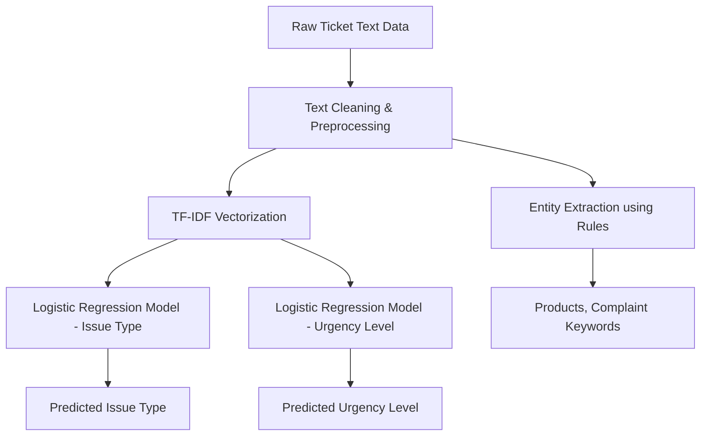

# 🧾 Simple Ticket Classifier – ML Project

> Predict Issue Type and Urgency Level from Customer Support Tickets with Entity Extraction using Logistic Regression, TF-IDF, and Gradio.

---

## 📝 Project Summary

This project aims to **automatically classify customer support tickets** into predefined `Issue Type` and `Urgency Level` categories using traditional NLP and machine learning techniques. It also extracts important **entities like product names and complaint keywords** from the ticket text.

The goal is to streamline ticket triaging for support teams and offer a functional prototype that demonstrates a **classical ML pipeline** for text classification and entity extraction.

---

## ⚙️ Workflow Overview



---

## 📌 Features

* ✅ Predict **Issue Type** (e.g., Product Defect, Delivery Delay, Billing Issue)
* ✅ Predict **Urgency Level** (e.g., Low, Medium, High)
* ✅ Extract **Product Names** and **Complaint Keywords** using keyword matching
* ✅ Clean UI built using **Gradio**
* ✅ Lightweight and easy to deploy

---

## 💡 Technologies Used

* Python 3.13+
* Pandas, NLTK
* Scikit-learn (Logistic Regression, TF-IDF, LabelEncoder)
* Gradio (Web Interface)
* Joblib (Model Saving)

---

## 🔍 Key Concepts

### ✅ TF-IDF Vectorizer

The `TfidfVectorizer` converts the cleaned ticket text into a **numeric vector representation** that captures the **importance of each word** in the context of the entire dataset. These vectors are used as input to train the logistic regression models.

### ✅ Label Encoding

The target variables (`issue_type` and `urgency_level`) are **categorical text labels**. We convert them into numerical format using `LabelEncoder` so that the classifier can learn to predict them.

### ✅ Logistic Regression

We use two separate logistic regression models:

* One for predicting **Issue Type**
* One for predicting **Urgency Level**

These models are trained on the TF-IDF features and the encoded labels.

### ✅ Rule-Based Entity Extraction

We use a predefined list of **product names** and **complaint-related keywords**. If they appear in the ticket, they are extracted as entities using simple string matching.

---

Here’s the updated **“How to Run Locally”** section rewritten to reflect that your project was made using **`uv`** instead of traditional `pip` and virtualenv:

---

## 💻 How to Run Locally

### 1. Clone the Repository

```bash
git clone https://github.com/jatinydav557/ticket-classifier-gradio.git
cd ticket-classifier
```

### 2. Install Dependencies Using `uv`

> This project uses [`uv`](https://github.com/astral-sh/uv) – a fast Python package manager that handles environments and dependencies seamlessly.

If `uv` is not already installed, install it via pipx:

```bash
pip install pipx
pipx install uv
```

Then install dependencies in a **virtual environment** automatically:

```bash
uv venv
uv pip install -r requirements.txt
```

> 🔄 This will create and activate a virtual environment automatically in the `.venv/` folder.

### 3. Download NLTK Resources

Run this once to download essential NLTK data or simply execute all the cells in notebook.ipynb:

```bash
python -c "import nltk; nltk.download('punkt'); nltk.download('stopwords'); nltk.download('wordnet')"
```

### 4. Add Your Dataset

Place your dataset file (`ticket.csv`) inside the `csv_data/` folder.

Required columns:

* `ticket_text`
* `issue_type`
* `urgency_level`

### 5. Run the App

```bash
python app.py
```

Then open your browser and navigate to:

```
http://localhost:7860
```

to use the **Gradio interface**.

---


## 📊 Example

**Input Ticket:**

> *"No response for 3 days! This is unacceptable and needs immediate attention."*

**Predictions:**

* Issue Type: **Product Defect**
* Urgency Level: **High**
* Entities:

  ```json
  {
    "products": [],
    "complaints": []
  }
  ```

## 🤝 Acknowledgements

* Assignment provided by **Vijayi WFH Technologies Pvt Ltd**
---

